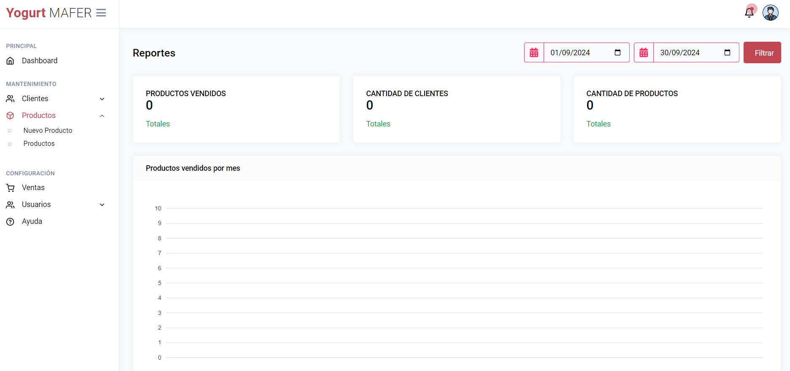

<div align="center">
    <a href="https://github.com/JheysonJhair/app_react_client_yogurth-mafer-main">
      
    </a>
    <h1>JhairDev - Administrador Yogurth Mafer</h1>
    <p align="center">
        Full Stack Developer Jhair
    </p>
</div>



# Sistema de administración de Yogurth

Bienvenido al **Sistema de administración de Yogur Maffer**, una aplicación frontend desarrollada para la gestion de inventario de **Yogurth Mafer**.

## Tecnologías Utilizadas

- **React**: Biblioteca principal utilizada para desarrollar la interfaz de usuario.
- **TypeScript**: Lenguaje utilizado para el desarrollo de la lógica de la aplicación.
- **Tailwind CSS**: Framework utilizado para el diseño y estilización de la interfaz de usuario.
- **Vite**: Herramienta de construcción y desarrollo que optimiza la velocidad de carga y el rendimiento durante el desarrollo.

---

## Módulos del Sistema

La aplicación cuenta con los siguientes módulos:

- **Módulo de Productos**: Gestión y administración de los productos de yogur disponibles para la venta.

- **Módulo de Venta**: Facilita la compra de productos de yogur mediante métodos de pago seguros e integrados, como **Izipay** y **Yape**.
- **Módulo de Reportes**: Genera informes sobre las ventas, productos más vendidos y estadísticas generales.
- **Módulo de Usuarios**: Administración de la información de los clientes registrados.
- **Módulo de Autenticación**: Permite la autenticación de usuarios para realizar compras de forma segura.

---

## Instalación

1. **Requisitos previos**:
   - Tener instalado **Node.js** y **npm** en tu sistema.
   - Back-end:

    ```bash
    git clone https://github.com/Edsghot/yogurth-mafer


2. **Clonar el repositorio**:
   ```bash
   git clone https://github.com/JheysonJhair/app_react_client_yogurth-mafer-main.git
   cd app_react_client_yogurth-mafer-main

3. **Instala las dependencias con `npm install`.**

    ```bash
    npm install
    ```

3. **Ejecuta el comando `npm run dev` para iniciar el servidor de desarrollo.**
    
    ```bash
    npm run dev
    ```

4. **Abre tu navegador y visita `http://localhost:5173`.**

¡Listo! Ahora puedes comenzar a trabajar en el Sistema sin problemas.


